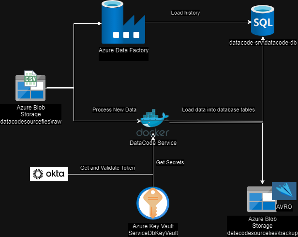
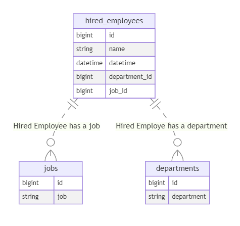

# Data Code Project Evaluation.

This project implements and API Service to receive new data.

-  Each new transaction fits the data dictionary rules
-  It can process up to 1000 rows per request
-  This service can load data for Jobs, Departments and Hired Employees

## Architecure

## Data Base Model.

### Mermaid code diagram
::: mermaid
erDiagram

    jobs {
        bigint id
        string job
    }

    departments {
        bigint id
        string department
    }

    hired_employees {
        bigint id
        string name
        datetime datetime
        bigint department_id
        bigint job_id
    }

    hired_employees ||..o{ jobs : "Hired Employee has a job"
    hired_employees ||..o{ departments : "Hired Employe has a department"

:::