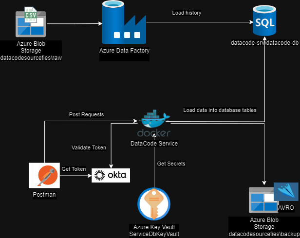

# Data Code Project Evaluation.

This project implements and API Service to receive new data.

-  Each new transaction fits the data dictionary rules
-  It can process up to 1000 rows per request
-  This service can load data for Jobs, Departments and Hired Employees

## Architecure

## Project Evaluation Components
This API was built using the following modules.
- FASTAPI
- OKTA-JWT
- SQLALCHEMY
- AZURE-IDENTITY
- AZURE-KEYVAULT
- AZURE-STORAGE-BLOB

## Data Base Model.

